# ChordFinder


## Description

ChordFinder is a Java-based music theory application that identifies possible triad chord names from three notes entered by a user. The system validates supported note spellings, maps notes to pitch positions, compares the submitted notes against maintained chord formulas, and returns all matching chord interpretations.

The application was designed using an object-oriented approach that focuses on modeling the main concepts in the Chord Finder domain as software objects. The design centers around the ChordFinderSystem, which coordinates note validation, chord identification, and formula maintenance. The main domain classes are ChordFinderSystem, ChordFormula, Chord, and Note.

ChordFinder also includes an administrator workflow for maintaining chord formulas. An administrator can define, edit, delete, and view chord formulas. Future chord searches use the current available formula set, which allows the system to be extended without redesigning the core chord identification behavior.

The project includes both JUnit unit tests and Cucumber BDD tests. The JUnit tests verify lower-level class behavior, while the Cucumber tests verify use-case behavior from the user and administrator perspective.

## Design Process

I used an object-oriented design approach by first understanding the Chord Finder problem domain before writing code. I identified the major behaviors the system needed to support: a Chord Finder User can identify chords from submitted notes, and an Administrator can maintain chord formulas.

The development process started with noun analysis and domain modeling. I reviewed the requirements and extracted important nouns such as ChordFinderSystem, ChordFormula, Chord, Note, chord name, pitch position, chord quality, administrator, and chord finder user. I then validated each noun by asking whether it represented a meaningful object with state and behavior.

The final domain model focused on four main classes: ChordFinderSystem, ChordFormula, Chord, and Note. Supporting ideas such as pitch position, sharp-oriented name, flat-oriented name, chord quality, and display suffix were treated as attributes rather than separate classes.

Each class was designed with one main responsibility. Note handles spelling, pitch position, validation, and interval distance. ChordFormula stores the formula pattern and determines whether notes match that pattern. Chord represents an identified chord name using a root note and formula. ChordFinderSystem coordinates the application by validating notes, identifying chords, and maintaining formulas.

Overall, the project moved from requirements analysis, to use case modeling, to domain modeling, to Java implementation, and then to automated testing with JUnit and Cucumber BDD.

## Table of Contents

- [ChordFinder](#chordfinder)
  - [Description](#description)
  - [Design Process](#design-process)
  - [Table of Contents](#table-of-contents)
  - [Domain Modeling](#domain-modeling)
  - [Use Cases](#use-cases)
    - [Find Chord](#find-chord)
    - [Maintain Chord Formula](#maintain-chord-formula)
  - [UML Class Diagram](#uml-class-diagram)
    - [Classes](#classes)
  - [ChordFinderSystem](#chordfindersystem)
  - [ChordFormula](#chordformula)
  - [Chord](#chord)
  - [Note](#note)
  - [Main](#main)
    - [Relationships](#relationships)
  - [Application Flow](#application-flow)
  - [Design Decisions](#design-decisions)
  - [Object-Oriented Design Principles](#object-oriented-design-principles)
  - [BDD Traceability to Use Cases](#bdd-traceability-to-use-cases)
    - [Find Chord BDD Traceability](#find-chord-bdd-traceability)
    - [Maintain Chord Formula BDD Traceability](#maintain-chord-formula-bdd-traceability)
    - [BDD Scenario Examples](#bdd-scenario-examples)
  - [TDD Traceability to Methods](#tdd-traceability-to-methods)
    - [Traceability Summary](#traceability-summary)
  - [Installation](#installation)
    - [Prerequisites](#prerequisites)
    - [Clone the Project](#clone-the-project)

## Domain Modeling

The domain model was created by identifying the objects that exist in the Chord Finder system universe and validating whether each object has meaningful state and behavior.

The core domain objects are:

ChordFinderSystem  
ChordFormula  
Chord  
Note  

ChordFinderSystem represents the main application. It owns the current set of chord formulas, validates submitted notes, identifies matching chords, and supports administrator formula maintenance.

ChordFormula represents a maintained formula definition. It stores a chord quality name, display suffix, and interval values such as root-to-third and root-to-fifth. The formula determines whether a submitted set of notes matches a chord type.

Chord represents an identified chord. It has a root note, a chord formula, and a generated chord name such as C maj, C min, G aug, or D# aug.

Note represents a submitted or recognized musical note. It stores the note spelling, pitch position, sharp-oriented name, flat-oriented name, and other recognized names. It also supports note validation and distance calculation between pitch positions.

This domain model keeps the system focused on the objects needed to support the required behavior without adding unnecessary classes for simple values or out-of-scope music theory concepts.


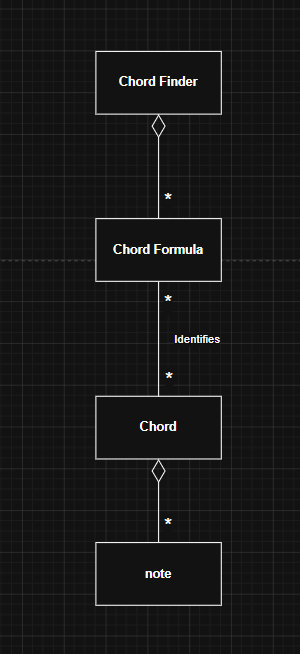


## Use Cases

The primary use cases in the ChordFinder application are Find Chord and Maintain Chord Formula.


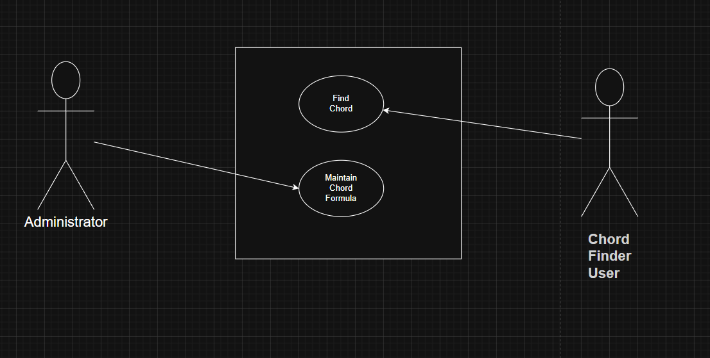


### Find Chord

Primary Actor: Chord Finder User

The Chord Finder User enters exactly three notes and submits them for chord identification. The system validates the notes, compares them against the available chord formulas, and displays all matching chord names.


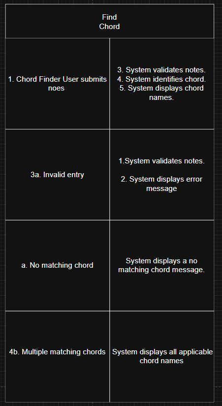

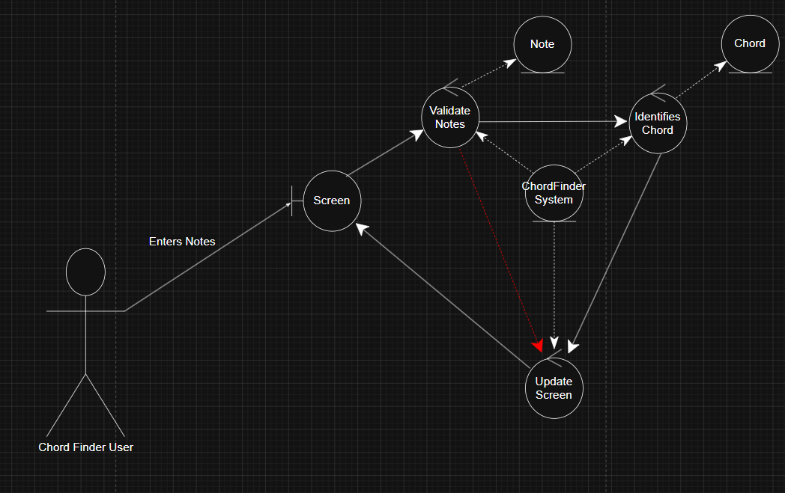

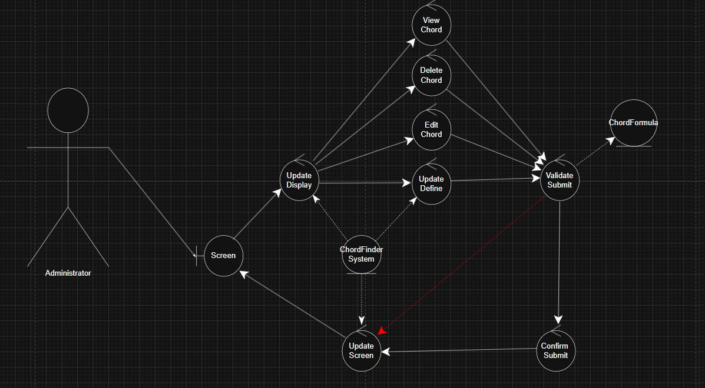


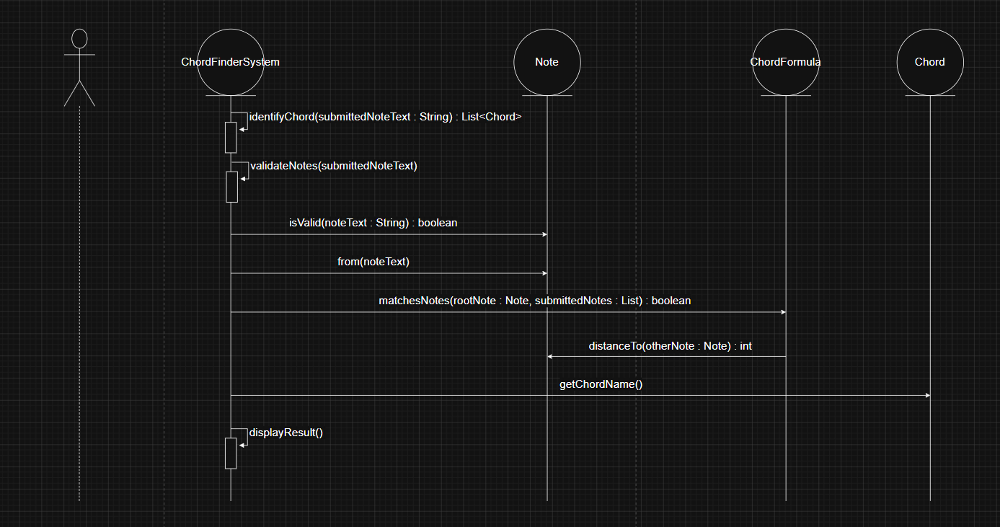

Alternative flows:

- If fewer than three notes are entered, the system displays an invalid note count message.
- If more than three notes are entered, the system displays an invalid note count message.
- If a note spelling is invalid, the system displays an invalid note message.
- If valid notes do not match any chord formula, the system displays a no matching chord message.
- If more than one chord interpretation exists, the system displays all matching chord names.

### Maintain Chord Formula

Primary Actor: Administrator

The Administrator maintains the chord formulas used by future chord searches. This use case includes defining, editing, deleting, and viewing chord formulas.

Main flow:

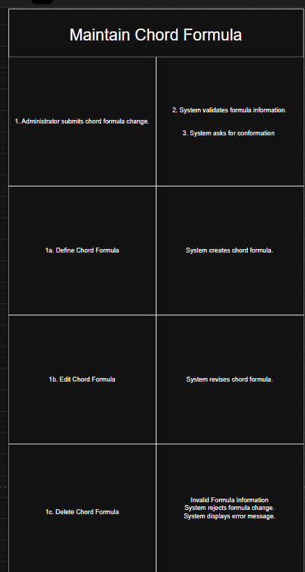


Supported actions:

- Define Chord Formula
- Edit Chord Formula
- Delete Chord Formula
- View Chord Formulas

## UML Class Diagram

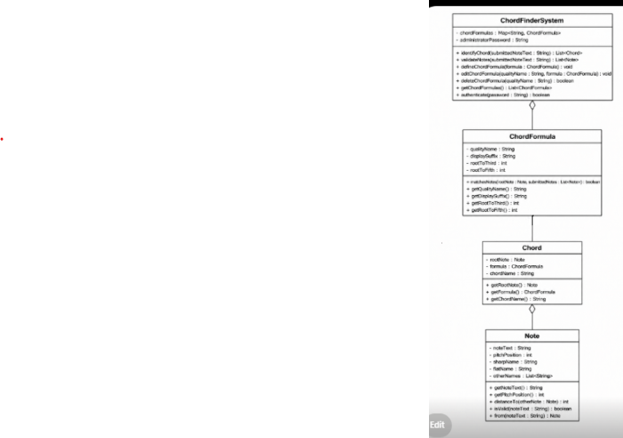

### Classes

ChordFinderSystem
-----------------
- chordFormulas : List<ChordFormula>
- submittedNotes : List<Note>
- identifiedChords : List<Chord>
- resultMessage : String

+ identifyChord(submittedNoteText : String) : List<Chord>
+ validateNotes(submittedNoteText : String) : List<Note>
+ defineChordFormula(formula : ChordFormula) : void
+ editChordFormula(qualityName : String, revisedFormula : ChordFormula) : void
+ deleteChordFormula(qualityName : String) : boolean
+ getChordFormulas() : List<ChordFormula>
+ displayResult() : void

ChordFormula
------------
- qualityName : String
- displaySuffix : String
- rootToThird : int
- rootToFifth : int

+ matchesNotes(rootNote : Note, submittedNotes : List<Note>) : boolean
+ updateFormula(qualityName : String, displaySuffix : String, rootToThird : int, rootToFifth : int) : void
+ getQualityName() : String
+ getDisplaySuffix() : String
+ getRootToThird() : int
+ getRootToFifth() : int

Chord
-----
- rootNote : Note
- chordFormula : ChordFormula
- notes : List<Note>
- chordName : String

+ getChordName() : String
+ getRootNote() : Note
+ getChordFormula() : ChordFormula
+ getNotes() : List<Note>

Note
----
- spelling : String
- pitchPosition : int
- sharpName : String
- flatName : String
- otherNames : List<String>

+ from(noteText : String) : Note
+ isValid(noteText : String) : boolean
+ isValid() : boolean
+ distanceTo(otherNote : Note) : int
+ getSpelling() : String
+ getPitchPosition() : int
+ getSharpName() : String
+ getFlatName() : String
+ getOtherNames() : List<String>

Main
----
- ADMIN_PASSWORD : String

+ main(args : String[]) : void
+ runChordFinderUser(scanner : Scanner, chordFinderSystem : ChordFinderSystem) : void
+ runAdministratorLogin(scanner : Scanner, chordFinderSystem : ChordFinderSystem) : void
+ runAdministratorMenu(scanner : Scanner, chordFinderSystem : ChordFinderSystem) : void


### Relationships

ChordFinderSystem has a ChordFormula enttiy

ChordFormula identifies Chord

Chord has a root Note


## Application Flow

The application begins by asking whether the person using the program is a Chord Finder User or an Administrator.

If the person selects Chord Finder User, the system starts the Find Chord workflow. The user enters three notes separated by spaces. The system validates the input, checks the notes against the available formulas, and displays the matching chord names.

If the person selects Administrator, the system asks for the administrator password. After a successful login, the administrator can define, edit, delete, or view chord formulas. Any changes made to the formula list affect future chord searches.

The core application flow is:

1. Start application.
2. Select role.
3. Run Find Chord or Maintain Chord Formula.
4. Validate input.
5. Process the selected behavior.
6. Display result.
7. Return to menu or exit.


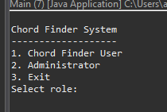
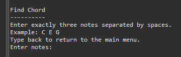
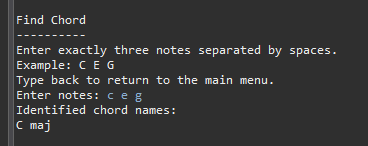
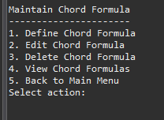
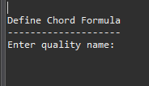
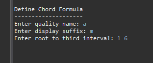
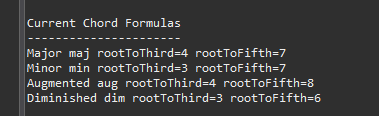
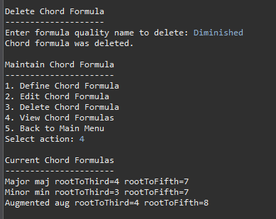


## Design Decisions

I designed ChordFinder around the main domain objects instead of putting all behavior into one large procedural class. The goal was to make the code reflect the real problem domain.

I kept ChordFinderSystem as the main coordinating class because the system needs one object responsible for validating notes, using formulas, identifying chords, and maintaining formulas.

I kept ChordFormula as a separate class because formulas are maintained by the administrator and are used by future chord searches. Each formula has its own quality name, display suffix, and interval pattern.

I kept Chord as a separate class because the system identifies chords, not just text names. A chord has a root note, formula, and generated chord name.

I kept Note as a separate class because note validation and pitch position mapping are central to the system. A note is not just a string; it has spelling, pitch position, and alternate names.

I did not create separate classes for pitch position, sharp name, flat name, chord quality, or display suffix because those concepts are simple values that belong inside Note or ChordFormula.

I also did not keep SearchResult as a separate class because the result behavior can be handled by ChordFinderSystem through identified chords and result messages.

## Object-Oriented Design Principles

ChordFinder uses encapsulation by grouping related data and behavior inside individual classes. Note contains note-related data and behavior, ChordFormula contains formula-related data and behavior, Chord contains chord result data, and ChordFinderSystem coordinates system-level behavior.

The design uses aggregation to show that ChordFinderSystem has a collection of ChordFormula objects and that Chord is made from three Note objects. The formulas are maintained by the system, while notes and chords are created during chord identification.

Association is used where objects interact without strong ownership. For example, ChordFormula is associated with Chord because a formula classifies a chord. ChordFinderSystem is associated with Note because it validates submitted notes during chord identification.

The design follows high cohesion because each class has a focused responsibility. Note handles note behavior, ChordFormula handles formula behavior, Chord handles chord result behavior, and ChordFinderSystem handles coordination.

The design also supports low coupling because each class interacts through clear method calls. The system can add or edit formulas without changing the Note or Chord classes.


## BDD Traceability to Use Cases

BDD was used to test the system behavior from the actor and use case perspective. The BDD scenarios connect directly to the main use cases and verify what the Chord Finder User and Administrator expect the system to do.

### Find Chord BDD Traceability

```text
Use Case: Find Chord

Behavior                                      BDD Scenario
---------------------------------------------------------------------------
User submits valid major triad                Identify G major from D G B

User submits valid minor triad                Identify C minor from C Eb G

User submits augmented triad                  Identify multiple augmented chords from B D# G

User submits fewer than three notes           Reject fewer than three notes

User submits more than three notes            Reject more than three notes

User submits invalid note spelling            Reject invalid note spelling

User submits valid notes with no match        Display no matching chord message
```

### Maintain Chord Formula BDD Traceability

```text
Use Case: Maintain Chord Formula

Behavior                                      BDD Scenario
---------------------------------------------------------------------------
Administrator defines chord formula           Future searches use newly defined formula

Administrator edits chord formula             Future searches use revised formula

Administrator deletes chord formula           Future searches no longer use deleted formula

Administrator submits invalid formula info    Reject invalid formula information
```

### BDD Scenario Examples

```gherkin
Feature: Find Chord

Scenario: Identify a major chord
  Given the Chord Finder System has default chord formulas
  When the Chord Finder User submits "D G B"
  Then the system should display "G maj"

Scenario: Identify a minor chord
  Given the Chord Finder System has default chord formulas
  When the Chord Finder User submits "C Eb G"
  Then the system should display "C min"

Scenario: Identify multiple augmented chords
  Given the Chord Finder System has default chord formulas
  When the Chord Finder User submits "B D# G"
  Then the system should display "B aug"
  And the system should display "D# aug"
  And the system should display "G aug"

Scenario: Reject fewer than three notes
  Given the Chord Finder System has default chord formulas
  When the Chord Finder User submits "C G"
  Then the system should display an invalid note count message

Scenario: Reject more than three notes
  Given the Chord Finder System has default chord formulas
  When the Chord Finder User submits "C E G B"
  Then the system should display an invalid note count message

Scenario: Reject invalid note spelling
  Given the Chord Finder System has default chord formulas
  When the Chord Finder User submits "C H G"
  Then the system should display an invalid note message

Scenario: Display no matching chord
  Given the Chord Finder System has default chord formulas
  When the Chord Finder User submits "C D E"
  Then the system should display a no matching chord message
```

```gherkin
Feature: Maintain Chord Formula

Scenario: Administrator defines a chord formula
  Given the Chord Finder System has default chord formulas
  When the Administrator defines a chord formula with quality "Suspended Fourth", suffix "sus4", root-to-third 5, and root-to-fifth 7
  And the Chord Finder User submits "C F G"
  Then the system should display "C sus4"

Scenario: Administrator edits a chord formula
  Given the Chord Finder System has a chord formula with quality "Suspended Fourth"
  When the Administrator edits the chord formula suffix to "sus"
  And the Chord Finder User submits "C F G"
  Then the system should display "C sus"

Scenario: Administrator deletes a chord formula
  Given the Chord Finder System has default chord formulas
  When the Administrator deletes the "Minor" chord formula
  And the Chord Finder User submits "C Eb G"
  Then the system should display a no matching chord message
```

## TDD Traceability to Methods

TDD was used to test the individual methods and classes that implement the system behavior. The unit tests verify note validation, pitch position mapping, interval calculation, formula matching, chord identification, no-match handling, and administrator formula maintenance.

```text
Class / Method                                               Unit Test
------------------------------------------------------------------------------------------------
Note.from(noteText : String)                                 shouldCreateValidNote

Note.from(noteText : String)                                 shouldTreatLowercaseInputAsValid

Note.from(noteText : String)                                 shouldRejectInvalidNoteSpelling

Note.getPitchPosition()                                      shouldMapEnharmonicNotesToSamePitchPosition

Note.distanceTo(otherNote : Note)                            shouldCalculateDistanceBetweenNotes

ChordFormula.matchesNotes(rootNote, submittedNotes)          majorFormulaShouldMatchMajorTriad

ChordFormula.matchesNotes(rootNote, submittedNotes)          minorFormulaShouldMatchMinorTriad

ChordFormula.matchesNotes(rootNote, submittedNotes)          majorFormulaShouldNotMatchMinorTriad

ChordFinderSystem.identifyChord(submittedNoteText)           shouldIdentifyGMajorFromNotesInAnyOrder

ChordFinderSystem.identifyChord(submittedNoteText)           shouldIdentifyCMinor

ChordFinderSystem.identifyChord(submittedNoteText)           shouldIdentifyMultipleAugmentedChords

ChordFinderSystem.identifyChord(submittedNoteText)           shouldReturnEmptyListWhenNoChordMatches

ChordFinderSystem.validateNotes(submittedNoteText)           shouldRejectFewerThanThreeNotes

ChordFinderSystem.validateNotes(submittedNoteText)           shouldRejectMoreThanThreeNotes

ChordFinderSystem.validateNotes(submittedNoteText)           shouldRejectInvalidNoteSpelling

ChordFinderSystem.defineChordFormula(formula)                shouldUseNewFormulaAfterAdministratorDefinesFormula

ChordFinderSystem.editChordFormula(qualityName, formula)     shouldUseRevisedFormulaAfterAdministratorEditsFormula

ChordFinderSystem.deleteChordFormula(qualityName)            shouldNotUseFormulaAfterAdministratorDeletesFormula

Chord.getChordName()                                         shouldReturnFormattedChordName
```

### Traceability Summary

```text
Use Case Behavior
        ↓
BDD Scenario
        ↓
Class / Method
        ↓
TDD Unit Test
```

The traceability shows that each required behavior is connected to a use case, each use case is covered by BDD scenarios, and each scenario is supported by tested class methods. This creates a clear path from requirements to design, implementation, and automated verification.

## Installation

### Prerequisites

Before running the application, make sure the following software is installed:

- Java Development Kit (JDK) 17 or later
- Maven
- Git
- Eclipse, IntelliJ IDEA, VS Code, or another Java-compatible IDE

### Clone the Project

```bash
git clone https://github.com/theReal4m4d3u5/chordFinder.git
cd chordFinder
