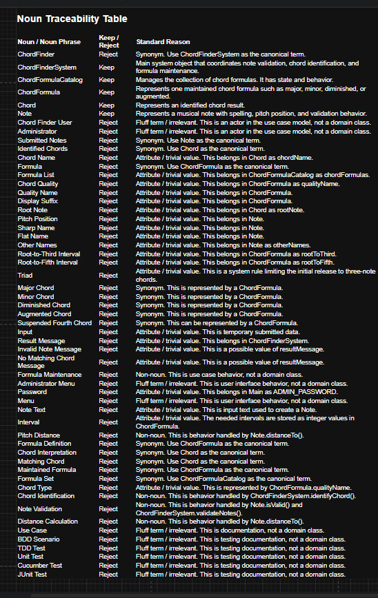
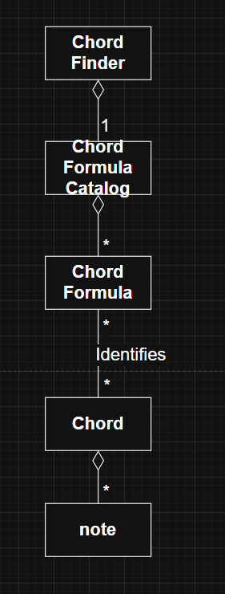
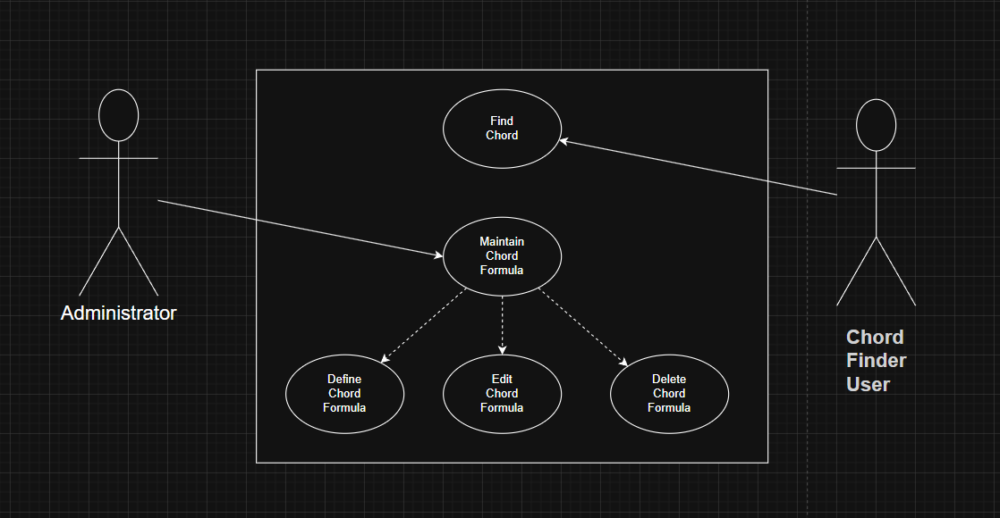
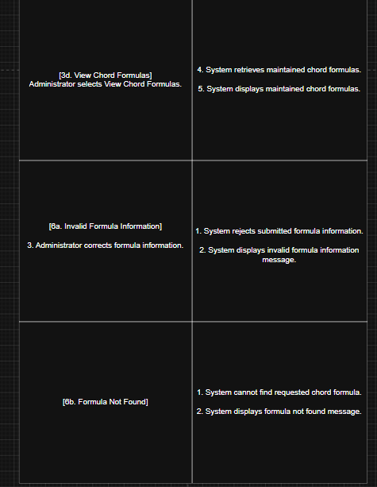
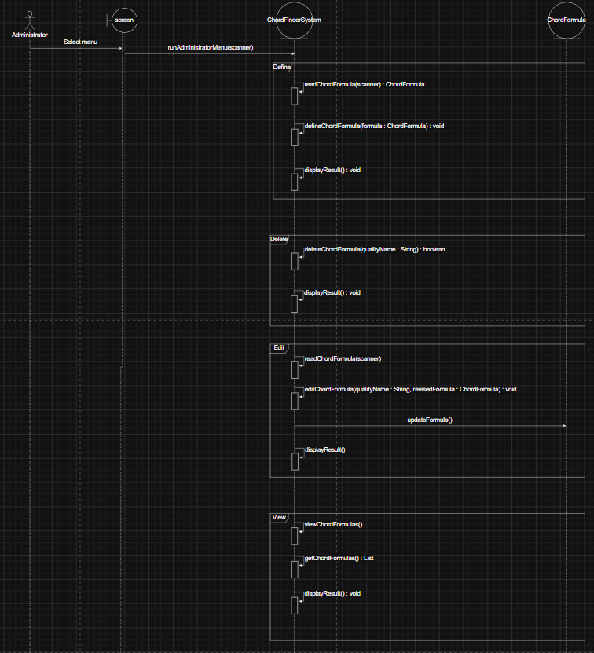
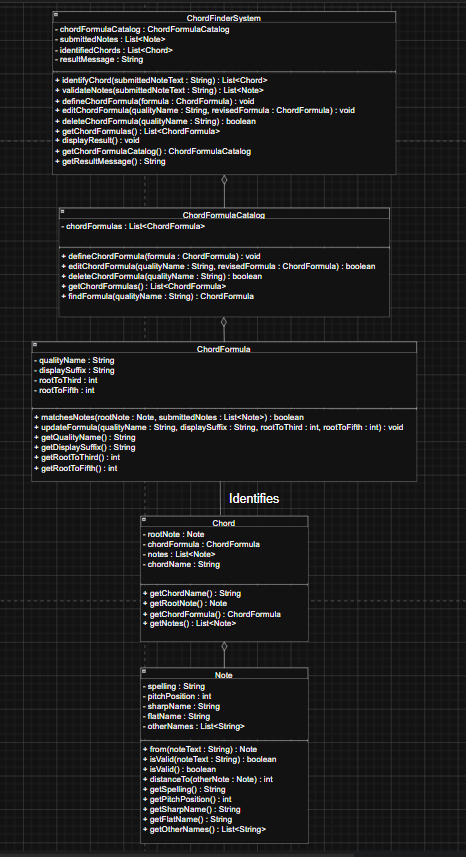

# ChordFinder


## Description

ChordFinder is a Java-based music theory application that identifies possible triad chord names from three notes entered by a user. The system validates supported note spellings, maps notes to pitch positions, compares the submitted notes against maintained chord formulas, and returns all matching chord interpretations.

The application was designed using an object-oriented approach that focuses on modeling the main concepts in the Chord Finder domain as software objects. The design centers around the ChordFinderSystem, which coordinates note validation, chord identification, and formula maintenance. The main domain classes are ChordFinderSystem, ChordFormula, Chord, and Note.

ChordFinder also includes an administrator workflow for maintaining chord formulas. An administrator can define, edit, delete, and view chord formulas. Future chord searches use the current available formula set, which allows the system to be extended without redesigning the core chord identification behavior.

The project includes both JUnit unit tests and Cucumber BDD tests. The JUnit tests verify lower-level class behavior, while the Cucumber tests verify use-case behavior from the user and administrator perspective.

## Design Process

I used an object-oriented design approach by first understanding the Chord Finder problem domain before writing code. I identified the major behaviors the system needed to support: a Chord Finder User can identify chords from submitted notes, and an Administrator can maintain chord formulas.

The development process started with noun analysis and domain modeling. I reviewed the requirements and extracted important nouns such as ChordFinderSystem, ChordFormula, Chord, Note, chord name, pitch position, chord quality, administrator, and chord finder user. I then validated each noun by asking whether it represented a meaningful object with state and behavior.

The final domain model focused on four main classes: ChordFinderSystem, ChordFormula, Chord, and Note. Supporting ideas such as pitch position, sharp-oriented name, flat-oriented name, chord quality, and display suffix were treated as attributes rather than separate classes.

Each class was designed with one main responsibility. Note handles spelling, pitch position, validation, and interval distance. ChordFormula stores the formula pattern and determines whether notes match that pattern. Chord represents an identified chord name using a root note and formula. ChordFinderSystem coordinates the application by validating notes, identifying chords, and maintaining formulas.

Overall, the project moved from requirements analysis, to use case modeling, to domain modeling, to Java implementation, and then to automated testing with JUnit and Cucumber BDD.

## Table of Contents

- [ChordFinder](#chordfinder)
  - [Description](#description)
  - [Design Process](#design-process)
  - [Table of Contents](#table-of-contents)
  - [Noun Analysis](#noun-analysis)
  - [Domain Modeling](#domain-modeling)
  - [Use Cases](#use-cases)
    - [Find Chord](#find-chord)
    - [Maintain Chord Formula](#maintain-chord-formula)
  - [UML Class Diagram](#uml-class-diagram)
    - [Classes](#classes)
  - [Application Flow](#application-flow)
  - [Design Decisions](#design-decisions)
  - [Object-Oriented Design Principles](#object-oriented-design-principles)
  - [BDD Traceability to Use Cases](#bdd-traceability-to-use-cases)
    - [Find Chord BDD Traceability](#find-chord-bdd-traceability)
  - [Behavior                                      BDD Scenario](#behavior--------------------------------------bdd-scenario)
    - [Maintain Chord Formula BDD Traceability](#maintain-chord-formula-bdd-traceability)
  - [Behavior                                      BDD Scenario](#behavior--------------------------------------bdd-scenario-1)
    - [BDD Scenarios](#bdd-scenarios)
  - [TDD Traceability to Methods](#tdd-traceability-to-methods)
  - [Class / Method                                      TDD Test](#class--method--------------------------------------tdd-test)
    - [Traceability Summary](#traceability-summary)
  - [Installation](#installation)
    - [Prerequisites](#prerequisites)
    - [Clone the Project](#clone-the-project)


## Noun Analysis 





## Domain Modeling

The domain model was created by identifying the meaningful entities that exist in the Chord Finder system universe and validating whether each object has meaningful state and behavior.

The core domain objects are:

ChordFinderSystem  
ChordFormulaCatalog  
ChordFormula  
Chord  
Note  

ChordFinderSystem represents the main application object that coordinates the system behavior. It receives submitted note text, validates the notes, identifies matching chords, stores the submitted notes, stores the identified chord results, and provides access to formula maintenance behavior through the ChordFormulaCatalog. The ChordFinderSystem does not represent one chord or one formula; it represents the overall system that controls the chord-finding process.

ChordFormulaCatalog represents the maintained collection of chord formulas used by the system. It owns the list of ChordFormula objects and is responsible for adding, editing, deleting, finding, and returning chord formulas. This separates formula maintenance from the main ChordFinderSystem so the system can coordinate the use cases while the catalog manages the formula collection.

ChordFormula represents one maintained chord formula definition. It stores the chord quality name, display suffix, and interval values such as root-to-third and root-to-fifth. A ChordFormula is responsible for determining whether a submitted set of notes matches that formula by comparing pitch distances from a possible root note.

Chord represents an identified chord result. It contains the root note, the chord formula that matched, the notes used to identify the chord, and the generated chord name. For example, if the submitted notes match a C major formula, the Chord object represents the identified result such as C, Cm, Cdim, or Caug depending on the matching formula.

Note represents a submitted or recognized musical note. It stores the note spelling, pitch position, sharp-oriented name, flat-oriented name, and other recognized names. Note is responsible for validating note text, creating Note objects from submitted input, and calculating the distance between pitch positions so chord formulas can determine matches.

This domain model keeps the system focused on the objects needed to support the required behavior without adding unnecessary classes for simple values or out-of-scope music theory concepts.





## Use Cases

The primary use cases in the ChordFinder application are Find Chord and Maintain Chord Formula.


### Find Chord

Primary Actor: Chord Finder User

The Chord Finder User enters exactly three notes and submits them for chord identification. The system validates the notes, compares them against the available chord formulas, and displays all matching chord names.


Alternative flows:

- If fewer than three notes are entered, the system displays an invalid note count message.
- If more than three notes are entered, the system displays an invalid note count message.
- If a note spelling is invalid, the system displays an invalid note message.
- If valid notes do not match any chord formula, the system displays a no matching chord message.
- If more than one chord interpretation exists, the system displays all matching chord names.

### Maintain Chord Formula

Primary Actor: Administrator

The Administrator maintains the chord formulas used by future chord searches. This use case includes defining, editing, deleting, and viewing chord formulas.

Main flow:

Supported actions:

- Define Chord Formula
- Edit Chord Formula
- Delete Chord Formula
- View Chord Formulas








## UML Class Diagram



### Classes

Class: ChordFinderSystem

- chordFormulaCatalog : ChordFormulaCatalog
- submittedNotes : List<Note>
- identifiedChords : List<Chord>
- resultMessage : String

+ identifyChord(submittedNoteText : String) : List<Chord>
+ validateNotes(submittedNoteText : String) : List<Note>
+ defineChordFormula(formula : ChordFormula) : void
+ editChordFormula(qualityName : String, revisedFormula : ChordFormula) : void
+ deleteChordFormula(qualityName : String) : boolean
+ getChordFormulas() : List<ChordFormula>
+ displayResult() : void
+ getChordFormulaCatalog() : ChordFormulaCatalog
+ getResultMessage() : String

Class: ChordFormulaCatalog

- chordFormulas : List<ChordFormula>

+ defineChordFormula(formula : ChordFormula) : void
+ editChordFormula(qualityName : String, revisedFormula : ChordFormula) : boolean
+ deleteChordFormula(qualityName : String) : boolean
+ getChordFormulas() : List<ChordFormula>
+ findFormula(qualityName : String) : ChordFormula

Class: ChordFormula

- qualityName : String
- displaySuffix : String
- rootToThird : int
- rootToFifth : int

+ matchesNotes(rootNote : Note, submittedNotes : List<Note>) : boolean
+ updateFormula(qualityName : String, displaySuffix : String, rootToThird : int, rootToFifth : int) : void
+ getQualityName() : String
+ getDisplaySuffix() : String
+ getRootToThird() : int
+ getRootToFifth() : int

Class: Chord

- rootNote : Note
- chordFormula : ChordFormula
- notes : List<Note>
- chordName : String

+ getChordName() : String
+ getRootNote() : Note
+ getChordFormula() : ChordFormula
+ getNotes() : List<Note>

Class: Note

- spelling : String
- pitchPosition : int
- sharpName : String
- flatName : String
- otherNames : List<String>

+ from(noteText : String) : Note
+ isValid(noteText : String) : boolean
+ isValid() : boolean
+ distanceTo(otherNote : Note) : int
+ getSpelling() : String
+ getPitchPosition() : int
+ getSharpName() : String
+ getFlatName() : String
+ getOtherNames() : List<String>

Class: Main

- ADMIN_PASSWORD : String

+ main(args : String[]) : void
+ runChordFinderUser(scanner : Scanner, chordFinderSystem : ChordFinderSystem) : void
+ runAdministratorLogin(scanner : Scanner, chordFinderSystem : ChordFinderSystem) : void
+ runAdministratorMenu(scanner : Scanner, chordFinderSystem : ChordFinderSystem) : void
+ defineChordFormula(scanner : Scanner, chordFinderSystem : ChordFinderSystem) : void
+ editChordFormula(scanner : Scanner, chordFinderSystem : ChordFinderSystem) : void
+ deleteChordFormula(scanner : Scanner, chordFinderSystem : ChordFinderSystem) : void
+ viewChordFormulas(chordFinderSystem : ChordFinderSystem) : void
+ readChordFormula(scanner : Scanner) : ChordFormula


## Application Flow

The application begins by asking whether the person using the program is a Chord Finder User or an Administrator.

If the person selects Chord Finder User, the system starts the Find Chord workflow. The user enters three notes separated by spaces. The system validates the input, checks the notes against the available formulas, and displays the matching chord names.

If the person selects Administrator, the system asks for the administrator password. After a successful login, the administrator can define, edit, delete, or view chord formulas. Any changes made to the formula list affect future chord searches.

The core application flow is:

1. Start application.
2. Select role.
3. Run Find Chord or Maintain Chord Formula.
4. Validate input.
5. Process the selected behavior.
6. Display result.
7. Return to menu or exit.


## Design Decisions

The design keeps the Chord Finder system focused on the required behavior: identifying possible chord names from three submitted notes and allowing an administrator to maintain chord formulas.

A separate ChordFormulaCatalog class was added to manage the collection of chord formulas. This keeps formula maintenance responsibilities, such as adding, editing, deleting, finding, and returning formulas, separate from the main ChordFinderSystem.

ChordFormula was kept as its own class because it represents one chord definition, such as major, minor, diminished, or augmented. It stores the formula name, display suffix, and interval values used to determine whether submitted notes match that chord type.

Chord was kept separate from ChordFormula because a formula is only a definition, while a chord is an identified result. For example, major is a formula, but C major is an identified chord.

Note was modeled as its own class because notes have meaningful state and behavior. A note stores spelling and pitch position information, and it supports validation and pitch-distance calculations needed by chord formulas.

The system avoids unnecessary classes for simple values such as interval numbers, suffix text, or chord names. These are treated as attributes because they do not need separate behavior in the initial release.

The initial release is limited to triads, so each identified chord is based on three notes. This keeps the model aligned with the client’s current requirements without adding extra complexity for seventh chords, inversions, voicings, sound playback, or advanced music theory concepts.

Overall, the design separates responsibilities clearly: ChordFinderSystem coordinates the use cases, ChordFormulaCatalog manages formula storage, ChordFormula defines chord patterns, Note handles note behavior, and Chord represents the final identified result.

## Object-Oriented Design Principles

The design uses encapsulation by keeping each class responsible for its own data and behavior. ChordFormula stores its own formula values and contains the behavior needed to determine whether notes match that formula. Note stores note information and handles note validation and pitch-distance calculations.

The design uses single responsibility by giving each class one main purpose. ChordFinderSystem coordinates the main system behavior. ChordFormulaCatalog manages the collection of chord formulas. ChordFormula represents one formula definition. Chord represents an identified chord result. Note represents a musical note.

The design uses separation of concerns by keeping formula maintenance separate from chord identification. ChordFormulaCatalog handles adding, editing, deleting, finding, and returning formulas, while ChordFinderSystem focuses on validating submitted notes and identifying chord results.

The design uses aggregation where one object owns or manages a group of related objects. ChordFinderSystem owns one ChordFormulaCatalog, and ChordFormulaCatalog maintains many ChordFormula objects. A Chord also contains the Note objects used to identify it.

The design supports low coupling because classes interact through clear method calls instead of directly managing each other’s internal data. For example, ChordFinderSystem asks ChordFormulaCatalog for formulas instead of directly controlling the formula list.

The design supports high cohesion because each class contains behavior that closely matches its purpose. Note handles note behavior, ChordFormula handles formula matching, ChordFormulaCatalog handles formula collection management, and Chord represents the identified result.

The design avoids unnecessary classes for simple values. Items such as display suffix, interval numbers, and chord names are modeled as attributes because they do not need their own separate behavior in the initial release.

Overall, the design follows object-oriented principles by organizing the system around meaningful objects with clear responsibilities, meaningful state, and behavior that supports the required use cases.


## BDD Traceability to Use Cases

The BDD tests trace directly back to the main Chord Finder use cases. Each scenario confirms that the system behavior described in the use cases is supported by the design and implementation.

The Find Chord use case is covered by scenarios where a user submits three valid notes and the system identifies the correct chord. For example, when the user submits C E G, the system identifies C major. When the user submits C Eb G, the system identifies C minor. These scenarios confirm that the system can validate submitted notes, compare them against maintained chord formulas, and return matching chord names.

The Find Chord use case is also covered by alternate scenarios. If the user submits invalid note input, fewer than three notes, or more than three notes, the system rejects the input and does not identify a chord. If the user submits three valid notes that do not match any maintained chord formula, the system returns no matching chord result. These scenarios trace to the validation and no-match alternate paths in the use case.

The Maintain Chord Formula use case is covered by administrator scenarios for adding, editing, deleting, and viewing chord formulas. The define formula scenario confirms that a new ChordFormula can be added to the ChordFormulaCatalog and then used by the system during chord identification. The edit formula scenario confirms that an existing formula can be revised. The delete formula scenario confirms that a removed formula is no longer used to identify chords. The view formula scenario confirms that the system can return the maintained list of chord formulas.

The BDD scenarios also verify the connection between the two use cases. Formula maintenance affects chord identification because the ChordFinderSystem uses the ChordFormulaCatalog when matching submitted notes. This means that adding, editing, or deleting a formula changes what chords the system can identify.

Overall, the BDD tests provide traceability from the use case requirements to the system behavior. They show that the system supports the main paths and alternate paths for both finding chords and maintaining chord formulas.


### Find Chord BDD Traceability

Behavior                                      BDD Scenario
---------------------------------------------------------------------------
User submits valid major triad                Identify G major from D G B

User submits valid minor triad                Identify C minor from C Eb G

User submits augmented triad                  Identify multiple augmented chords from B D# G

User submits fewer than three notes           Reject fewer than three notes

User submits more than three notes            Reject more than three notes

User submits invalid note spelling            Reject invalid note spelling

User submits valid notes with no match        Display no matching chord message


### Maintain Chord Formula BDD Traceability


Behavior                                      BDD Scenario
---------------------------------------------------------------------------
Administrator defines new chord formula       Add suspended fourth formula

Administrator edits existing chord formula    Edit existing chord formula values

Administrator deletes chord formula           Delete minor chord formula

Administrator views chord formulas            View maintained chord formula list

Administrator adds formula used by search     Identify chord using newly added formula

Administrator deletes formula used by search  Removed formula is no longer used

Administrator edits formula used by search    Updated formula changes chord matching

Administrator enters unknown formula name      Display formula not found message


### BDD Scenarios 

Feature: Find Chord

Scenario: Identify G major from D G B

Given the Chord Finder system has a maintained major chord formula
When the user submits D G B
Then the system validates the submitted notes
And the system identifies G as a matching chord

Scenario: Identify C minor from C Eb G

Given the Chord Finder system has a maintained minor chord formula
When the user submits C Eb G
Then the system validates the submitted notes
And the system identifies Cm as a matching chord

Scenario: Identify multiple augmented chords from B D# G

Given the Chord Finder system has a maintained augmented chord formula
When the user submits B D# G
Then the system validates the submitted notes
And the system identifies multiple matching augmented chords

Scenario: Reject fewer than three notes

Given the user is using the Chord Finder system
When the user submits C E
Then the system rejects the submitted notes
And the system displays an invalid note entry message

Scenario: Reject more than three notes

Given the user is using the Chord Finder system
When the user submits C E G B
Then the system rejects the submitted notes
And the system displays an invalid note entry message

Scenario: Reject invalid note spelling

Given the user is using the Chord Finder system
When the user submits C H G
Then the system rejects the submitted notes
And the system displays an invalid note entry message

Scenario: Display no matching chord message

Given the Chord Finder system has maintained chord formulas
When the user submits C D G
Then the system validates the submitted notes
And the system does not identify a matching chord
And the system displays a no matching chord message

Feature: Maintain Chord Formula

Scenario: Add suspended fourth formula

Given the administrator is maintaining chord formulas
When the administrator defines a suspended fourth formula
Then the system adds the new formula to the ChordFormulaCatalog
And the formula becomes available for chord identification

Scenario: Edit existing chord formula values

Given the ChordFormulaCatalog contains an existing chord formula
When the administrator edits the formula values
Then the system updates the existing ChordFormula
And the revised formula is stored in the ChordFormulaCatalog

Scenario: Delete minor chord formula

Given the ChordFormulaCatalog contains a minor chord formula
When the administrator deletes the minor chord formula
Then the system removes the formula from the ChordFormulaCatalog
And the deleted formula is no longer available for chord identification

Scenario: View maintained chord formula list

Given the administrator is maintaining chord formulas
When the administrator selects view chord formulas
Then the system retrieves the maintained chord formulas
And the system displays the chord formula list

Scenario: Identify chord using newly added formula

Given the administrator has added a suspended fourth formula
When the user submits C F G
Then the system validates the submitted notes
And the system identifies Csus4 as a matching chord

Scenario: Removed formula is no longer used

Given the administrator has deleted the minor chord formula
When the user submits C Eb G
Then the system validates the submitted notes
And the system does not identify C minor

Scenario: Updated formula changes chord matching

Given the administrator has edited an existing chord formula
When the user submits notes that match the updated formula
Then the system uses the updated formula during chord identification
And the system returns the matching chord result

Scenario: Display formula not found message

Given the administrator is maintaining chord formulas
When the administrator tries to edit or delete a formula that does not exist
Then the system does not update the ChordFormulaCatalog
And the system displays a formula not found message


## TDD Traceability to Methods

TDD was used to test the individual methods and classes that implement the system behavior. The unit tests verify note validation, pitch position mapping, interval calculation, formula matching, chord identification, no-match handling, and administrator formula maintenance.


Class / Method                                      TDD Test
--------------------------------------------------------------------------------
ChordFinderSystem.identifyChord()                   shouldIdentifyMajorChord

ChordFinderSystem.identifyChord()                   shouldIdentifyMinorChord

ChordFinderSystem.identifyChord()                   shouldReturnEmptyListForNoMatchingChord

ChordFinderSystem.identifyChord()                   shouldUseNewFormulaAfterAdministratorDefinesFormula

ChordFinderSystem.identifyChord()                   shouldNotUseFormulaAfterAdministratorDeletesFormula

ChordFinderSystem.validateNotes()                   shouldRejectFewerThanThreeNotes

ChordFinderSystem.validateNotes()                   shouldRejectMoreThanThreeNotes

ChordFinderSystem.validateNotes()                   shouldRejectInvalidNoteSpelling

ChordFinderSystem.defineChordFormula()              shouldUseNewFormulaAfterAdministratorDefinesFormula

ChordFinderSystem.deleteChordFormula()              shouldNotUseFormulaAfterAdministratorDeletesFormula

ChordFormulaCatalog.getChordFormulas()              shouldStartWithDefaultFormulas

ChordFormulaCatalog.defineChordFormula()            shouldDefineNewFormula

ChordFormulaCatalog.editChordFormula()              shouldEditExistingFormula

ChordFormulaCatalog.deleteChordFormula()            shouldDeleteExistingFormula

ChordFormulaCatalog.findFormula()                   shouldEditExistingFormula

ChordFormula.matchesNotes()                         majorFormulaShouldMatchMajorTriad

ChordFormula.matchesNotes()                         minorFormulaShouldMatchMinorTriad

ChordFormula.matchesNotes()                         majorFormulaShouldNotMatchMinorTriad

ChordFormula.updateFormula()                        updateFormulaShouldReviseFormulaValues

Note.from()                                         shouldCreateValidNaturalNote

Note.from()                                         shouldCreateValidSharpNote

Note.from()                                         shouldCreateValidFlatNote

Note.isValid()                                      shouldRejectInvalidNoteText

Note.distanceTo()                                   shouldCalculateDistanceForward

Note.distanceTo()                                   shouldCalculateDistanceAcrossOctave


### Traceability Summary

```text
Use Case Behavior
        ↓
BDD Scenario
        ↓
Class / Method
        ↓
TDD Unit Test
```

The traceability shows that each required behavior is connected to a use case, each use case is covered by BDD scenarios, and each scenario is supported by tested class methods. This creates a clear path from requirements to design, implementation, and automated verification.

## Installation

### Prerequisites

Before running the application, make sure the following software is installed:

- Java Development Kit (JDK) 17 or later
- Maven
- Git
- Eclipse, IntelliJ IDEA, VS Code, or another Java-compatible IDE

### Clone the Project

```bash
git clone https://github.com/theReal4m4d3u5/chordFinder.git
cd chordFinder
