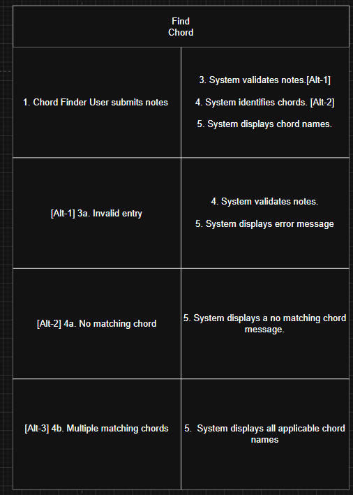
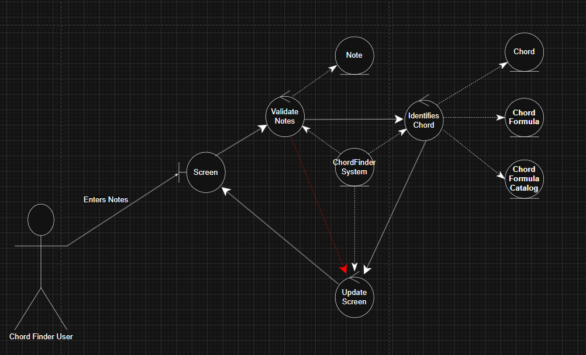
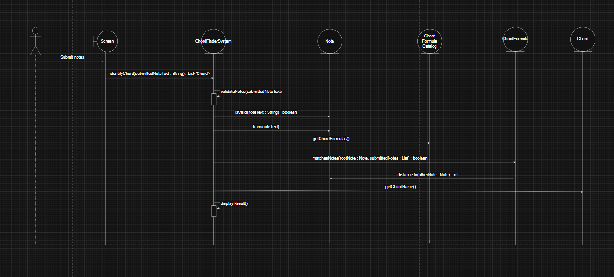
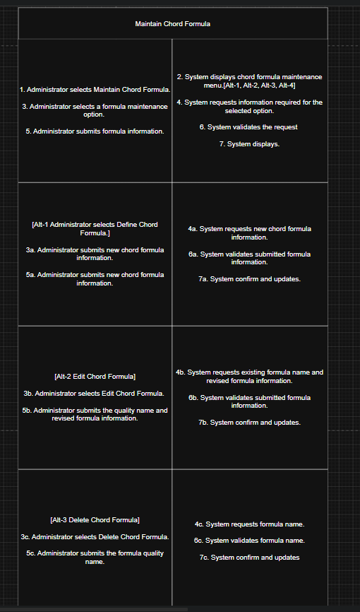
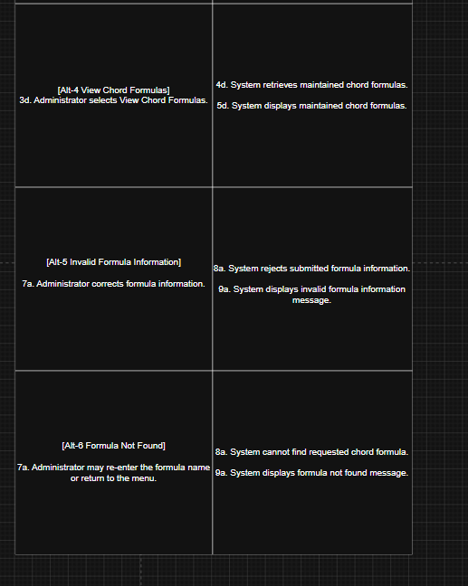
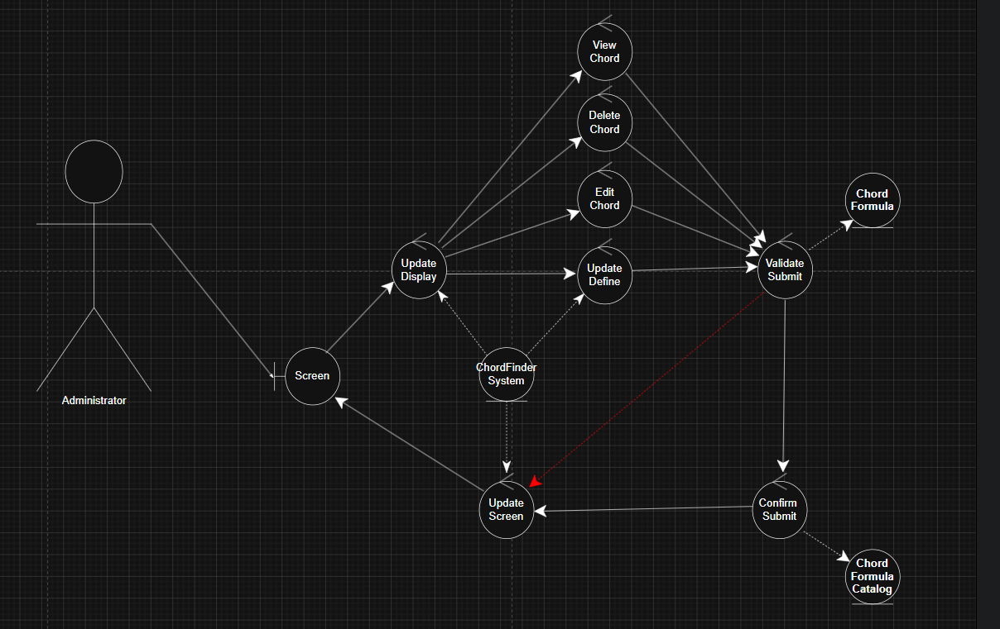
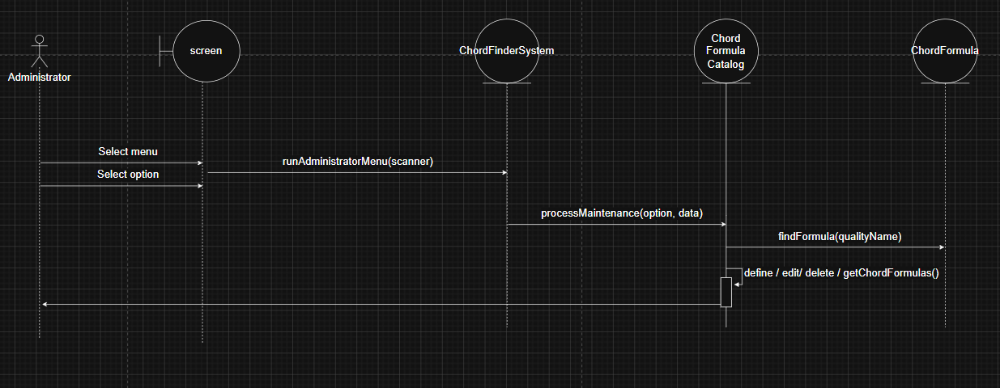

# ChordFinder


## Description

ChordFinder is a Java-based music theory application that identifies possible triad chord names from three notes entered by a user. The system validates supported note spellings, maps notes to pitch positions, compares the submitted notes against maintained chord formulas, and returns all matching chord interpretations.

The application was designed using an object-oriented approach that focuses on modeling the main concepts in the Chord Finder domain as software objects. The design centers around the ChordFinderSystem, which coordinates note validation, chord identification, and formula maintenance. The main domain classes are ChordFinderSystem, ChordFormula, Chord, and Note.

ChordFinder also includes an administrator workflow for maintaining chord formulas. An administrator can define, edit, delete, and view chord formulas. Future chord searches use the current available formula set, which allows the system to be extended without redesigning the core chord identification behavior.

The project includes both JUnit unit tests and Cucumber BDD tests. The JUnit tests verify lower-level class behavior, while the Cucumber tests verify use-case behavior from the user and administrator perspective.


## Problem 

The client needs a more consistent and reliable way to help students practice identifying basic chords. Their current materials, such as worksheets, flash cards, and whiteboard examples, are useful but difficult to update and not always available when students practice independently. The proposed Chord Finder system will let users enter three notes and receive possible chord names based on maintained chord formulas. It will also allow administrators to manage those chord formulas so the system can be updated as the client’s needs grow.


## Table of Contents

- [ChordFinder](#chordfinder)
  - [Description](#description)
  - [Problem](#problem)
  - [Table of Contents](#table-of-contents)
  - [Design Process](#design-process)
  - [Assumptions and Open Questions](#assumptions-and-open-questions)
  - [Design Decision Log](#design-decision-log)
  - [Noun Analysis](#noun-analysis)
  - [Domain Modeling](#domain-modeling)
  - [Use Cases](#use-cases)
    - [Find Chord](#find-chord)
    - [Maintain Chord Formula](#maintain-chord-formula)
  - [UML Class Diagram](#uml-class-diagram)
    - [Classes](#classes)
  - [Application Flow](#application-flow)
    - [BDD Scenarios](#bdd-scenarios)
  - [TDD Traceability to Methods](#tdd-traceability-to-methods)
  - [Class / Method                                      TDD Test](#class--method--------------------------------------tdd-test)
    - [Traceability Summary](#traceability-summary)
  - [Installation](#installation)
    - [Prerequisites](#prerequisites)
    - [Clone the Project](#clone-the-project)


## Design Process

I used an object-oriented design approach by first understanding the Chord Finder problem domain before writing code. I identified the major behaviors the system needed to support: a Chord Finder User can submit notes to identify possible chords, and an Administrator can maintain the chord formulas used by the system.

The development process started with noun analysis and domain modeling. I reviewed the requirements and extracted important nouns such as ChordFinderSystem, ChordFormulaCatalog, ChordFormula, Chord, Note, chord name, pitch position, chord quality, administrator, and chord finder user. I then evaluated each noun by asking whether it represented a meaningful object with state, behavior, and responsibility within the system.

The final domain model focused on five main classes: ChordFinderSystem, ChordFormulaCatalog, ChordFormula, Chord, and Note. Supporting ideas such as chord name, pitch position, formula intervals, chord quality, and display suffix were treated as attributes rather than separate classes. Actors such as Chord Finder User and Administrator were not modeled as domain classes because they interact with the system but are not objects the system needs to store or manage.

Each class was designed with a clear responsibility. Note handles note spelling, pitch position, validation, and interval distance. ChordFormula stores a chord pattern, quality, and suffix used to determine whether submitted notes match a formula. Chord represents an identified chord result using a root note and matching formula. ChordFormulaCatalog manages the collection of maintained formulas, including adding, editing, deleting, and viewing formulas. ChordFinderSystem coordinates the overall application by validating submitted notes, identifying chords, and using the formula catalog to maintain chord definitions.

The design was refined through use case modeling, sequence diagrams, and traceability between requirements, design, implementation, and tests. The implementation was then completed in Java, with automated testing using JUnit for unit tests and Cucumber BDD scenarios for behavior-level validation.

Overall, the project moved from requirements analysis, to noun analysis, to domain modeling, to use case and sequence modeling, to Java implementation, and finally to automated testing. This process helped keep the code aligned with the original Chord Finder requirements while still allowing the design to support future changes to chord formulas.

## Assumptions and Open Questions 
Several assumptions were made because the prompt does not define every detail of how the Chord Finder system should work. I assumed that the initial version only needs to identify triads made from exactly three submitted notes. I also assumed that the system should compare the submitted notes against maintained chord formulas such as major, minor, diminished, and augmented formulas. Since users may enter notes in different orders, I assumed the system should still be able to identify a chord even when the notes are not entered in root position.

I also assumed that note validation is part of the system’s responsibility. For example, the system should reject invalid note names or entries that do not contain exactly three notes. Supporting details such as pitch position, sharp or flat spelling, and chord suffixes were treated as attributes of domain objects rather than separate major classes unless the design later needs more detail.

In a real client engagement, I would ask whether the system needs to support enharmonic equivalents, such as C# and Db, and how those should be displayed in the results. I would also ask whether the client wants the system to return one best chord name or all possible matching chord names. Another open question is whether administrators should be able to add completely new chord formulas, edit existing formulas, delete formulas, or only update a fixed list provided by the client.

Because the client was unavailable for further clarification, I made design decisions that keep the system small but flexible. I limited the first release to three-note chords, treated the Chord Finder User and Administrator as actors rather than domain classes, and kept chord formulas as maintained system data so the application can be updated without changing the main chord-finding logic.


## Design Decision Log

| Decision | Alternatives Considered | Rationale |
|---|---|---|
| Use ChordFinderSystem as the main system class. | Considered whether ChordFormulaCatalog, ChordFormula, or Chord could handle the main coordination behavior. ChordFormulaCatalog manages formulas, ChordFormula represents one formula definition, and Chord represents one identified result. None of those classes should control the entire application workflow. | ChordFinderSystem is the best place for coordinating note validation, chord identification, and formula maintenance. The other classes have more focused responsibilities, so placing the main coordination behavior there would make those classes too broad and less cohesive. |
| Treat Chord Finder User as an actor instead of a class. | Considered whether ChordFinderSystem should store user information or whether a separate User class was needed. This would only make sense if the system needed user accounts, saved searches, practice history, or personalized settings. | The regular user only submits notes and receives chord results. The system does not need to store user accounts, profiles, or user history for the initial release, so modeling the user as a class would add unnecessary complexity. |
| Treat Administrator as an actor instead of a class. | Considered whether ChordFinderSystem or a separate Administrator class should store administrator data. This would be useful if the system required login accounts, permissions, audit history, or different administrator roles. | The administrator performs formula maintenance, but the prompt does not require storing administrator identity, login data, permissions, or history. Because the administrator is an external role interacting with the system, it is better represented as an actor. |
| Keep ChordFormulaCatalog as a class. | Considered whether ChordFinderSystem could manage the chord formula collection directly. ChordFinderSystem could technically hold the formula list, but that would mix formula storage and maintenance behavior with the main chord-finding workflow. | ChordFormulaCatalog has its own responsibility because it manages the collection of maintained chord formulas. Separating it keeps formula maintenance easier to manage, prevents ChordFinderSystem from becoming too large, and supports future changes to formula management. |
| Keep ChordFormula as a class. | Considered whether ChordFormulaCatalog or ChordFinderSystem could store formula details without a separate ChordFormula class. This would mean storing formula data as strings, numbers, or lists directly inside another class. | A chord formula has its own state and behavior because it stores a formula pattern and is used to determine whether submitted notes match that pattern. Since formulas are maintained by the administrator and used by the search process, ChordFormula should remain its own class. |
| Keep Note as a class. | Considered whether ChordFinderSystem, ChordFormula, or Chord could handle note validation and pitch behavior. This would reduce the number of classes, but it would spread note-related rules across the system. | Notes need validation, spelling, pitch position, and interval behavior, so they are more than simple text values. Keeping Note as a class places note-specific behavior in one location and makes chord matching easier to understand and test. |
| Keep Chord as a class. | Considered whether ChordFinderSystem could return chord names as plain text instead of creating Chord objects. Returning a string would be simpler, but it would lose the connection between the root note, formula, submitted notes, and generated chord name. | A chord is the identified result of the system and connects a root note with a matching chord formula. This gives it enough meaning, state, and future flexibility to be modeled as a class instead of only a text result. |
| Treat pitch position as an attribute of Note. | Considered whether PitchPosition should be its own class or whether Note could handle that state. A separate class would only be useful if pitch position had complex behavior or needed to be managed independently. | Pitch position supports note comparison, but it does not have enough independent behavior, identity, or lifecycle to justify a separate class. Note can manage this value directly because pitch position is part of what defines a note in this system. |
| Treat sharp and flat spellings as attributes of Note. | Considered whether NoteSpelling or EnharmonicName should be separate classes. These classes could be useful in a larger music theory system, but the current system only needs enough spelling support to validate notes and display results. | Spelling is important, but Note can handle this state and behavior without adding extra classes to the model. This keeps the model focused on the required chord-finding behavior while still supporting sharp and flat note names. |
| Combine submitted notes into a list of Note objects. | Considered whether SubmittedNotes should be its own class or whether ChordFinderSystem could hold a list of Note objects. A separate SubmittedNotes class would only be useful if the submitted note group had its own rules beyond count validation and storage. | Submitted notes are a temporary collection used during chord identification. The collection does not need independent behavior beyond holding Note objects, so a separate class is not necessary for the initial design. |
| Limit the first release to triads. | Considered whether ChordFormula should support seventh chords, inversions, voicings, or other advanced chord types immediately. Those features would make the system more powerful, but they would also add complexity beyond the client’s initial request. | The client’s initial problem is focused on identifying three-note chords. Limiting the release to triads keeps the system small, understandable, and aligned with the stated requirements while still allowing formulas to be extended later. |
| Return all matching chord names when appropriate. | Considered whether ChordFinderSystem should return only one Chord result. Returning one result would be simpler, but it could hide valid chord interpretations from the user. | Some note combinations can match more than one chord formula or chord name. Returning all valid matches gives a more complete result and better supports the client’s goal of helping users learn basic harmony. |
| Keep chord formulas as maintained system data. | Considered whether ChordFinderSystem should hard-code formulas directly. Hard-coding formulas would be simpler at first, but it would make future changes harder because formula updates would require code changes. | The client wants administrative support for maintaining chord formulas, so formulas should be stored and managed as system data. This allows the system to change formulas without redesigning or rewriting the main chord-finding logic. |
| Validate submitted notes before identifying chords. | Considered whether ChordFinderSystem, Note, or ChordFormula should handle invalid input later in the process. Waiting until later would make chord identification responsible for handling bad input, which would make the process less clear. | Validation should happen first so invalid input does not reach the chord identification logic. This keeps the system behavior clearer, more reliable, and easier to test because invalid note count and invalid spelling are handled before formula matching begins. |
| Use aggregation between ChordFormulaCatalog and ChordFormula. | Considered whether ChordFinderSystem should simply associate with formulas or directly own them. Direct ownership by ChordFinderSystem would work, but it would weaken the purpose of the catalog and make formula management less clearly separated. | The catalog manages a collection of chord formulas, so aggregation best represents the whole-part relationship in this model. This shows that formulas belong to the maintained catalog and supports the design choice to keep formula maintenance separate from chord identification. |    


## Noun Analysis 


## Domain Modeling

The domain model was created by identifying the meaningful entities that exist in the Chord Finder system universe and validating whether each object has meaningful state and behavior.

The core domain objects are:

ChordFinderSystem  
ChordFormulaCatalog  
ChordFormula  
Chord  
Note  

ChordFinderSystem represents the main application object that coordinates the system behavior. It receives submitted note text, validates the notes, identifies matching chords, stores the submitted notes, stores the identified chord results, and provides access to formula maintenance behavior through the ChordFormulaCatalog. The ChordFinderSystem does not represent one chord or one formula; it represents the overall system that controls the chord-finding process.

ChordFormulaCatalog represents the maintained collection of chord formulas used by the system. It owns the list of ChordFormula objects and is responsible for adding, editing, deleting, finding, and returning chord formulas. This separates formula maintenance from the main ChordFinderSystem so the system can coordinate the use cases while the catalog manages the formula collection.

ChordFormula represents one maintained chord formula definition. It stores the chord quality name, display suffix, and interval values such as root-to-third and root-to-fifth. A ChordFormula is responsible for determining whether a submitted set of notes matches that formula by comparing pitch distances from a possible root note.

Chord represents an identified chord result. It contains the root note, the chord formula that matched, the notes used to identify the chord, and the generated chord name. For example, if the submitted notes match a C major formula, the Chord object represents the identified result such as C, Cm, Cdim, or Caug depending on the matching formula.

Note represents a submitted or recognized musical note. It stores the note spelling, pitch position, sharp-oriented name, flat-oriented name, and other recognized names. Note is responsible for validating note text, creating Note objects from submitted input, and calculating the distance between pitch positions so chord formulas can determine matches.

This domain model keeps the system focused on the objects needed to support the required behavior without adding unnecessary classes for simple values or out-of-scope music theory concepts.


## Use Cases

The primary use cases in the ChordFinder application are Find Chord and Maintain Chord Formula.


### Find Chord

Primary Actor: Chord Finder User

The Chord Finder User enters exactly three notes and submits them for chord identification. The system validates the notes, compares them against the available chord formulas, and displays all matching chord names.









Alternative flows:

- If fewer than three notes are entered, the system displays an invalid note count message.
- If more than three notes are entered, the system displays an invalid note count message.
- If a note spelling is invalid, the system displays an invalid note message.
- If valid notes do not match any chord formula, the system displays a no matching chord message.
- If more than one chord interpretation exists, the system displays all matching chord names.

### Maintain Chord Formula

Primary Actor: Administrator

The Administrator maintains the chord formulas used by future chord searches. This use case includes defining, editing, deleting, and viewing chord formulas.

Main flow:

Supported actions:

- Define Chord Formula
- Edit Chord Formula
- Delete Chord Formula
- View Chord Formulas








## UML Class Diagram


### Classes

Class: ChordFinderSystem

- chordFormulaCatalog : ChordFormulaCatalog
- submittedNotes : List<Note>
- identifiedChords : List<Chord>
- resultMessage : String

+ identifyChord(submittedNoteText : String) : List<Chord>
+ validateNotes(submittedNoteText : String) : List<Note>
+ defineChordFormula(formula : ChordFormula) : void
+ editChordFormula(qualityName : String, revisedFormula : ChordFormula) : void
+ deleteChordFormula(qualityName : String) : boolean
+ getChordFormulas() : List<ChordFormula>
+ displayResult() : void
+ getChordFormulaCatalog() : ChordFormulaCatalog
+ getResultMessage() : String

Class: ChordFormulaCatalog

- chordFormulas : List<ChordFormula>

+ defineChordFormula(formula : ChordFormula) : void
+ editChordFormula(qualityName : String, revisedFormula : ChordFormula) : boolean
+ deleteChordFormula(qualityName : String) : boolean
+ getChordFormulas() : List<ChordFormula>
+ findFormula(qualityName : String) : ChordFormula

Class: ChordFormula

- qualityName : String
- displaySuffix : String
- rootToThird : int
- rootToFifth : int

+ matchesNotes(rootNote : Note, submittedNotes : List<Note>) : boolean
+ updateFormula(qualityName : String, displaySuffix : String, rootToThird : int, rootToFifth : int) : void
+ getQualityName() : String
+ getDisplaySuffix() : String
+ getRootToThird() : int
+ getRootToFifth() : int

Class: Chord

- rootNote : Note
- chordFormula : ChordFormula
- notes : List<Note>
- chordName : String

+ getChordName() : String
+ getRootNote() : Note
+ getChordFormula() : ChordFormula
+ getNotes() : List<Note>

Class: Note

- spelling : String
- pitchPosition : int
- sharpName : String
- flatName : String
- otherNames : List<String>

+ from(noteText : String) : Note
+ isValid(noteText : String) : boolean
+ isValid() : boolean
+ distanceTo(otherNote : Note) : int
+ getSpelling() : String
+ getPitchPosition() : int
+ getSharpName() : String
+ getFlatName() : String
+ getOtherNames() : List<String>

Class: Main

- ADMIN_PASSWORD : String

+ main(args : String[]) : void
+ runChordFinderUser(scanner : Scanner, chordFinderSystem : ChordFinderSystem) : void
+ runAdministratorLogin(scanner : Scanner, chordFinderSystem : ChordFinderSystem) : void
+ runAdministratorMenu(scanner : Scanner, chordFinderSystem : ChordFinderSystem) : void
+ defineChordFormula(scanner : Scanner, chordFinderSystem : ChordFinderSystem) : void
+ editChordFormula(scanner : Scanner, chordFinderSystem : ChordFinderSystem) : void
+ deleteChordFormula(scanner : Scanner, chordFinderSystem : ChordFinderSystem) : void
+ viewChordFormulas(chordFinderSystem : ChordFinderSystem) : void
+ readChordFormula(scanner : Scanner) : ChordFormula


## Application Flow

The application begins by asking whether the person using the program is a Chord Finder User or an Administrator.

If the person selects Chord Finder User, the system starts the Find Chord workflow. The user enters three notes separated by spaces. The system validates the input, checks the notes against the available formulas, and displays the matching chord names.

If the person selects Administrator, the system asks for the administrator password. After a successful login, the administrator can define, edit, delete, or view chord formulas. Any changes made to the formula list affect future chord searches.

The core application flow is:

1. Start application.
2. Select role.
3. Run Find Chord or Maintain Chord Formula.
4. Validate input.
5. Process the selected behavior.
6. Display result.
7. Return to menu or exit.


### BDD Scenarios 

Feature: Find Chord

Scenario: Identify G major from D G B

Given the Chord Finder system has a maintained major chord formula
When the user submits D G B
Then the system validates the submitted notes
And the system identifies G as a matching chord

Scenario: Identify C minor from C Eb G

Given the Chord Finder system has a maintained minor chord formula
When the user submits C Eb G
Then the system validates the submitted notes
And the system identifies Cm as a matching chord

Scenario: Identify C diminished from C Eb Gb

Given the Chord Finder system has a maintained diminished chord formula
When the user submits C Eb Gb
Then the system validates the submitted notes
And the system identifies Cdim as a matching chord

Scenario: Identify multiple augmented chords from B D# G

Given the Chord Finder system has a maintained augmented chord formula
When the user submits B D# G
Then the system validates the submitted notes
And the system identifies Baug as a matching chord
And the system identifies D#aug as a matching chord
And the system identifies Gaug as a matching chord

Scenario: Identify chord regardless of note order

Given the Chord Finder system has a maintained major chord formula
When the user submits E G C
Then the system validates the submitted notes
And the system identifies C as a matching chord

Scenario: Identify chord using flat note spelling

Given the Chord Finder system has a maintained major chord formula
When the user submits Db F Ab
Then the system validates the submitted notes
And the system identifies Db as a matching chord

Scenario: Identify chord using sharp note spelling

Given the Chord Finder system has a maintained major chord formula
When the user submits C# F G#
Then the system validates the submitted notes
And the system identifies C# as a matching chord

Scenario: Identify chord when input has extra spaces

Given the Chord Finder system has a maintained major chord formula
When the user submits " C E G "
Then the system validates the submitted notes
And the system identifies C as a matching chord

Scenario: Identify chord when input uses lowercase notes

Given the Chord Finder system has a maintained major chord formula
When the user submits c e g
Then the system validates the submitted notes
And the system identifies C as a matching chord

Scenario: Reject fewer than three notes

Given the user is using the Chord Finder system
When the user submits C E
Then the system rejects the submitted notes
And the system displays an error message that exactly three notes are required

Scenario: Reject more than three notes

Given the user is using the Chord Finder system
When the user submits C E G B
Then the system rejects the submitted notes
And the system displays an error message that exactly three notes are required

Scenario: Reject invalid note spelling

Given the user is using the Chord Finder system
When the user submits C H G
Then the system rejects the submitted notes
And the system displays an invalid note message

Scenario: Reject unsupported accidental spelling

Given the user is using the Chord Finder system
When the user submits C## E G
Then the system rejects the submitted notes
And the system displays an invalid note message

Scenario: Reject blank note input

Given the user is using the Chord Finder system
When the user submits blank note input
Then the system rejects the submitted notes
And the system displays a message that notes are required

Scenario: Display no matching chord message

Given the Chord Finder system has maintained chord formulas
When the user submits C D E
Then the system validates the submitted notes
And the system displays a no matching chord message

Scenario: Display no match for duplicate submitted notes

Given the user is using the Chord Finder system
When the user submits C C E
Then the system rejects the submitted notes
And the system displays a message that three different notes are required

Scenario: Display no match when formula catalog is empty

Given the Chord Finder system has no maintained chord formulas
When the user submits C E G
Then the system validates the submitted notes
And the system displays a no matching chord message

Feature: Maintain Chord Formula

Scenario: Define a new chord formula

Given the administrator is using the Maintain Chord Formula menu
When the administrator defines a chord formula with valid formula information
Then the system stores the chord formula
And the system displays the updated formula catalog

Scenario: Edit an existing chord formula

Given the Chord Finder system has a maintained chord formula
And the administrator is using the Maintain Chord Formula menu
When the administrator edits the chord formula with valid formula information
Then the system updates the chord formula
And the system displays the updated formula catalog

Scenario: Delete an existing chord formula

Given the Chord Finder system has a maintained chord formula
And the administrator is using the Maintain Chord Formula menu
When the administrator deletes the chord formula
Then the system removes the chord formula
And the system displays the updated formula catalog

Scenario: View maintained chord formulas

Given the Chord Finder system has maintained chord formulas
And the administrator is using the Maintain Chord Formula menu
When the administrator views the chord formulas
Then the system displays the maintained chord formulas

Scenario: View empty chord formula catalog

Given the Chord Finder system has no maintained chord formulas
And the administrator is using the Maintain Chord Formula menu
When the administrator views the chord formulas
Then the system displays a message that no chord formulas are maintained

Scenario: Reject invalid formula information

Given the administrator is using the Maintain Chord Formula menu
When the administrator defines a chord formula with invalid formula information
Then the system rejects the chord formula
And the system displays an invalid formula message

Scenario: Reject duplicate formula name

Given the Chord Finder system already has a maintained major chord formula
And the administrator is using the Maintain Chord Formula menu
When the administrator defines another formula named major
Then the system rejects the chord formula
And the system displays a duplicate formula name message

Scenario: Reject duplicate formula pattern

Given the Chord Finder system already has a maintained major chord formula
And the administrator is using the Maintain Chord Formula menu
When the administrator defines another formula with the same interval pattern as major
Then the system rejects the chord formula
And the system displays a duplicate formula pattern message

Scenario: Display formula not found when editing

Given the Chord Finder system does not have a formula named suspended
And the administrator is using the Maintain Chord Formula menu
When the administrator attempts to edit the suspended formula
Then the system displays a formula not found message

Scenario: Display formula not found when deleting

Given the Chord Finder system does not have a formula named suspended
And the administrator is using the Maintain Chord Formula menu
When the administrator attempts to delete the suspended formula
Then the system displays a formula not found message

Scenario: Use newly defined formula in future chord searches

Given the administrator defines a valid suspended chord formula
When the user submits C F G
Then the system validates the submitted notes
And the system identifies Csus4 as a matching chord

Scenario: Use edited formula in future chord searches

Given the Chord Finder system has a maintained chord formula
And the administrator edits the chord formula with valid formula information
When the user submits notes that match the edited formula
Then the system identifies a chord using the edited formula

Scenario: Do not use deleted formula in future chord searches

Given the Chord Finder system has a maintained suspended chord formula
And the administrator deletes the suspended chord formula
When the user submits C F G
Then the system validates the submitted notes
And the system does not identify Csus4 as a matching chord

Scenario: Cancel formula definition

Given the administrator is defining a new chord formula
When the administrator cancels the formula definition
Then the system does not store the chord formula
And the system returns to the Maintain Chord Formula menu

Scenario: Cancel formula edit

Given the Chord Finder system has a maintained chord formula
And the administrator is editing the chord formula
When the administrator cancels the formula edit
Then the system does not change the chord formula
And the system returns to the Maintain Chord Formula menu

Scenario: Cancel formula deletion

Given the Chord Finder system has a maintained chord formula
And the administrator is deleting the chord formula
When the administrator cancels the formula deletion
Then the system does not remove the chord formula
And the system returns to the Maintain Chord Formula menu

## TDD Traceability to Methods

TDD was used to test the individual methods and classes that implement the system behavior. The unit tests verify note validation, pitch position mapping, interval calculation, formula matching, chord identification, no-match handling, and administrator formula maintenance.


Class / Method                                      TDD Test
--------------------------------------------------------------------------------
ChordFinderSystem.identifyChord()                   shouldIdentifyMajorChord

ChordFinderSystem.identifyChord()                   shouldIdentifyMinorChord

ChordFinderSystem.identifyChord()                   shouldReturnEmptyListForNoMatchingChord

ChordFinderSystem.identifyChord()                   shouldUseNewFormulaAfterAdministratorDefinesFormula

ChordFinderSystem.identifyChord()                   shouldNotUseFormulaAfterAdministratorDeletesFormula

ChordFinderSystem.validateNotes()                   shouldRejectFewerThanThreeNotes

ChordFinderSystem.validateNotes()                   shouldRejectMoreThanThreeNotes

ChordFinderSystem.validateNotes()                   shouldRejectInvalidNoteSpelling

ChordFinderSystem.defineChordFormula()              shouldUseNewFormulaAfterAdministratorDefinesFormula

ChordFinderSystem.deleteChordFormula()              shouldNotUseFormulaAfterAdministratorDeletesFormula

ChordFormulaCatalog.getChordFormulas()              shouldStartWithDefaultFormulas

ChordFormulaCatalog.defineChordFormula()            shouldDefineNewFormula

ChordFormulaCatalog.editChordFormula()              shouldEditExistingFormula

ChordFormulaCatalog.deleteChordFormula()            shouldDeleteExistingFormula

ChordFormulaCatalog.findFormula()                   shouldEditExistingFormula

ChordFormula.matchesNotes()                         majorFormulaShouldMatchMajorTriad

ChordFormula.matchesNotes()                         minorFormulaShouldMatchMinorTriad

ChordFormula.matchesNotes()                         majorFormulaShouldNotMatchMinorTriad

ChordFormula.updateFormula()                        updateFormulaShouldReviseFormulaValues

Note.from()                                         shouldCreateValidNaturalNote

Note.from()                                         shouldCreateValidSharpNote

Note.from()                                         shouldCreateValidFlatNote

Note.isValid()                                      shouldRejectInvalidNoteText

Note.distanceTo()                                   shouldCalculateDistanceForward

Note.distanceTo()                                   shouldCalculateDistanceAcrossOctave


### Traceability Summary

```text
Use Case Behavior
        ↓
BDD Scenario
        ↓
Class / Method
        ↓
TDD Unit Test
```

The traceability shows that each required behavior is connected to a use case, each use case is covered by BDD scenarios, and each scenario is supported by tested class methods. This creates a clear path from requirements to design, implementation, and automated verification.

## Installation

### Prerequisites

Before running the application, make sure the following software is installed:

- Java Development Kit (JDK) 25 or later
- Maven
- Git
- Eclipse, IntelliJ IDEA, VS Code, or another Java-compatible IDE

### Clone the Project

```bash
git clone https://github.com/theReal4m4d3u5/chordFinder.git
cd chordFinder


AI Usage 

https://chatgpt.com/share/6a4d5075-e3fc-83ea-8b90-b8567e334af5 
https://chatgpt.com/share/6a4d508a-0a34-83ea-99c7-3d1ed0573ca2 
https://chatgpt.com/share/6a4d5016-b5cc-83ea-97f3-6aa9f517b3b5
https://chatgpt.com/share/6a4d501f-b268-83ea-b293-9234df955686 
https://chatgpt.com/share/6a4d502b-d94c-83ea-bc93-40185a049fcb 
https://chatgpt.com/share/6a4d502b-d94c-83ea-bc93-40185a049fcb 
https://chatgpt.com/share/6a4d5042-7b5c-83ea-8017-0e97c48a1b9c 
https://chatgpt.com/share/6a4d504f-0cec-83ea-9adc-cc4dc328d059 
https://chatgpt.com/share/6a4d5062-4d78-83ea-88aa-3a5a932f2621 
https://chatgpt.com/share/6a4d506d-5f78-83ea-a6b4-e6be2b1d8817 
